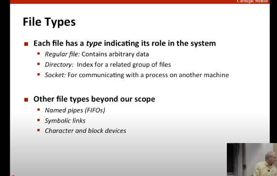
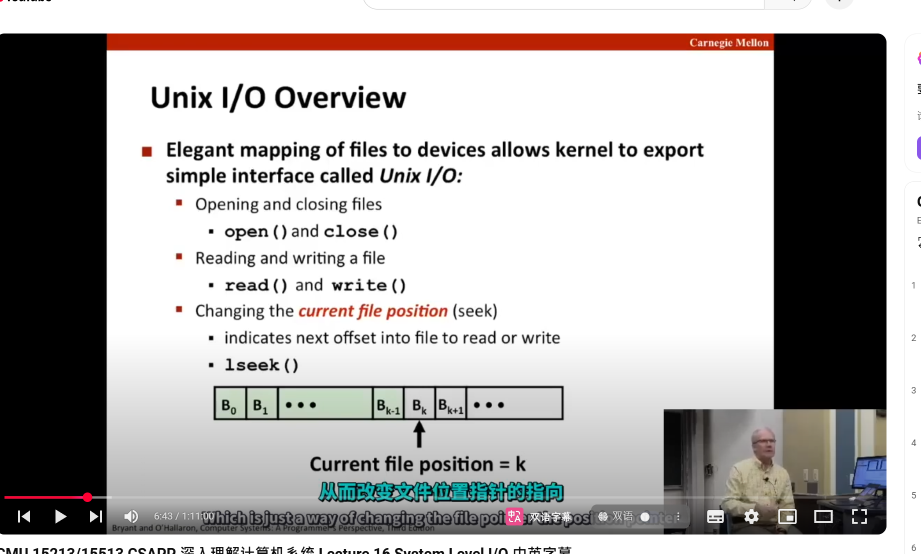
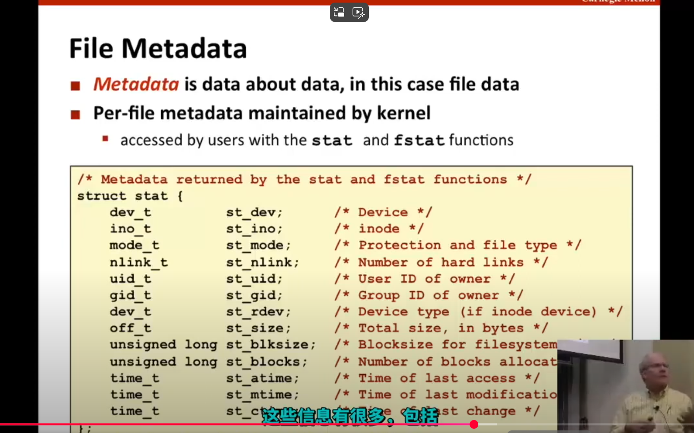
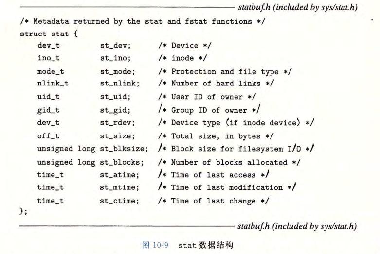
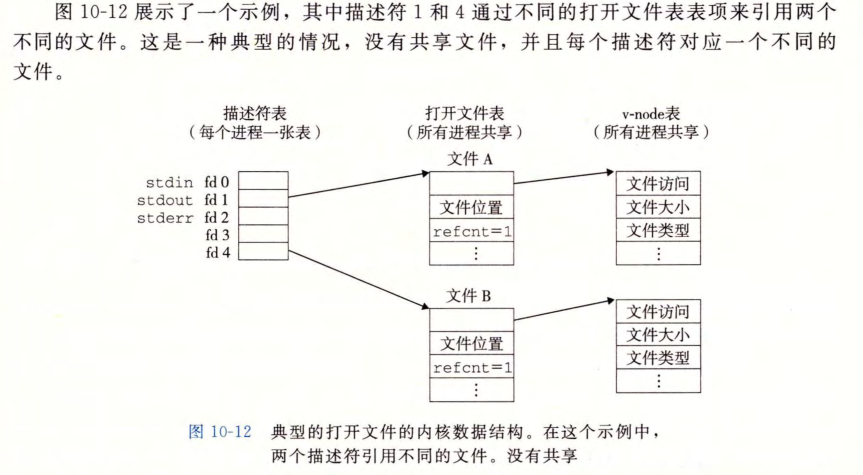
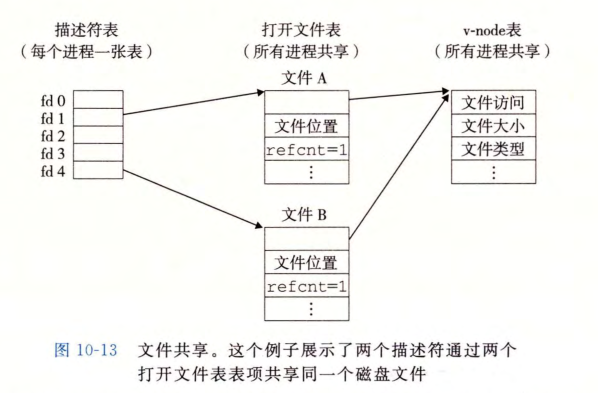
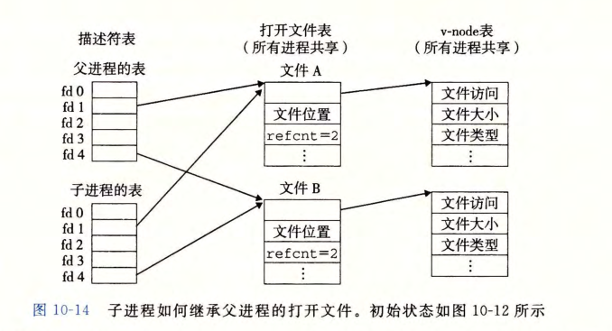

## 文件分为文本文件和二进制文件

1. 文本文件:只包含ASCII字符或Unicode字符
2. 其他文件全是二进制文件,音频,图像,目标文件...
   内核眼里都一样

## 文件类型:

## UNIX的I/O接口:

## 文件元数据

## stat

## 共享文件
- 描述符表 (descriptor table) 。每个进程都有它独立的描述符表，它的表项是由进程打开的文件描述符来索引的 。每个打开的描述符表项指向文件表中的一个表项。
- 文件表 (file table) 。打开文件的集合是由一张文件表来表示的，所有的进程共享这张表。每个文件表的表项组成（针对我们的目的）包括当前的文件位置、引用计数(reference count) (即当前指向该表项的描述符表项数），以及一个指向v-node 表中对应表项的指针 。 关闭一个描述符会减少相应的文件表表项中的引用计数。内核不会删除这个文件表表项，直到它的引用计数为零。
- v-node 表 (v- node table) 。同文件表一样，所有的进程共享这张 v- node 表 。每个表项包含 stat 结构中的大多数信息，包括 st_mode 和 st_size 成员。

所以文件表的每个表项不是唯一的,不同文件表项可能指向同一个文件,只是文件位置不同

如图 10-13 所示，多个描述符也可以通过不同的文件表表项来引用同一个文件。例如，如果以同一个 filename 调用 open 函数两次，就会发生这种情况。关键思想是每个描述符都有它自己的文件位置，所以对不同描述符的读操作可以从文件的不同位置获取数据。

我们也能理解父子进程是如何共享文件的。假设在调用 fork 之前，父进程有如图 10-12 所示的打开文件。然后，图10-14 展示了调用 fork 后的情况。子进程有一个父进程描述符表的副本。父子进程共享相同的打开文件表集合，因此共享相同的文件位置。一个很重要的结果就是，在内核删除相应文件表表项之前，父子进程必须都关闭了它们的描述符。

---
>*我有个疑问,read函数有一个文件读写指针,那么该指针的指向是根据文件表中表项的文件位置决定的,还是由内核代码记录的?*
>在 UNIX/Linux 系统中，读写指针（文件偏移量）是存储在文件表（file table）中对应表项里的。也就是说，每个打开的文件在文件表中都有一项，其中包含当前的文件位置。内核在调用 read、write 等系统调用时，会利用这个文件表项中的文件位置进行操作，并在操作后更新该位置。
>因此，这个指针既不是由文件描述符表直接决定的，也不是内核在其他地方独立记录的，而是内核通过文件表项来跟踪的。

---